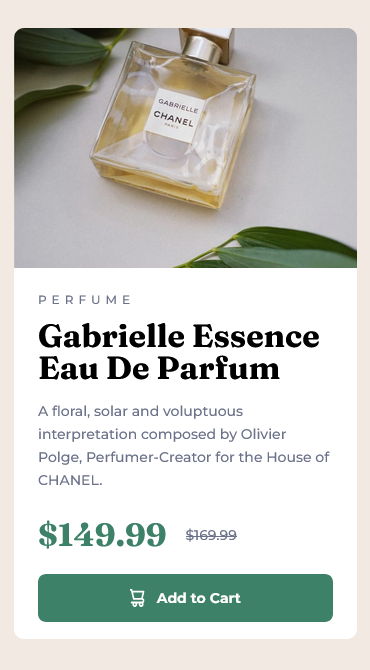
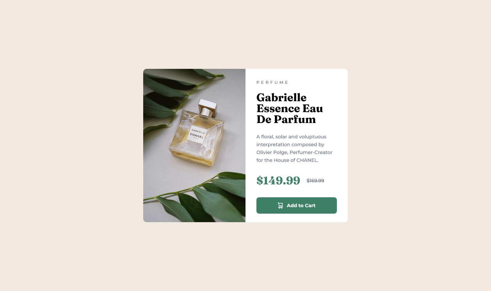

# Frontend Mentor - Product preview card component solution

This is a solution to the [Product preview card component challenge on Frontend Mentor](https://www.frontendmentor.io/challenges/product-preview-card-component-GO7UmttRfa). Frontend Mentor challenges help you improve your coding skills by building realistic projects. 

## Table of contents

- [Overview](#overview)
  - [The challenge](#the-challenge)
  - [Screenshot](#screenshot)
  - [Links](#links)
- [My process](#my-process)
  - [Built with](#built-with)
  - [What I learned](#what-i-learned)
  - [Continued development](#continued-development)
  - [Useful resources](#useful-resources)
- [Author](#author)
- [Acknowledgments](#acknowledgments)


## Overview

### The challenge

Users should be able to:

- View the optimal layout depending on their device's screen size
- See hover and focus states for interactive elements

### Screenshot





### Links

- Solution URL: [Add solution URL here](https://your-solution-url.com)
- Live Site URL: [Add live site URL here](https://your-live-site-url.com)

## My process

### Built with

- Semantic HTML5 markup
- CSS custom properties
- Flexbox
- CSS Grid
- SASS
- Mobile-first workflow


**Note: These are just examples. Delete this note and replace the list above with your own choices**

### What I learned

I tried to used mixins in SASS. I am not that proficient to use it and it is hard for me to spot a block of codes to simplify but I did my best for this project. 

This is the mixins I used:


```css
@mixin gridLayout($display, $template-column, $template-row){
    display: $display;
    grid-template-columns: $template-column;
    grid-template-rows: $template-row;
}
```
```css
// Mobile View
.container{
        @include gridLayout(grid, 240px 371px, 343px);
        justify-content: center;
        padding-top: 28px;
    }
// Desktop View
 .container{
            @include gridLayout(grid, repeat(2, 300px), 450px);
            padding: 0;
        }
```

### Continued development

I will continue to build projects related to html and css. I will try building landing pages in the near future to enhance my skills and increase the difficulty in my projects.


### Useful resources

- [MDN Web Docs](https://developer.mozilla.org/en-US/) - This helped me understand and guides me by providing comprehensive documentation on web development technologies such as HTML and CSS.
- [ChatGPT](https://chat.openai.com/) - This is very helpful to me. It is like a mentor because it can explain to you the block of codes.


## Author

- Website - [Add your name here](https://www.your-site.com)
- Frontend Mentor - [@jbuast](https://www.frontendmentor.io/profile/jbuast)


